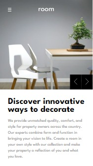
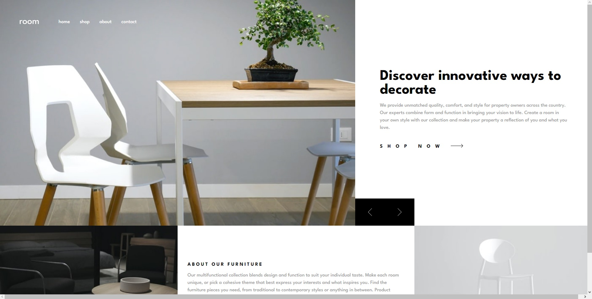

# Frontend Mentor - Room homepage solution

This is a solution to the [Room homepage challenge on Frontend Mentor](https://www.frontendmentor.io/challenges/room-homepage-BtdBY_ENq). Frontend Mentor challenges help you improve your coding skills by building realistic projects. 

## Table of contents

- [Overview](#overview)
  - [The challenge](#the-challenge)
  - [Screenshot](#screenshot)
  - [Links](#links)
- [Built with](#built-with)
- [Author](#author)

## Overview

### The challenge

Users should be able to:

- View the optimal layout for the site depending on their device's screen size
- See hover states for all interactive elements on the page
- Navigate the slider using either their mouse/trackpad or keyboard

### Screenshot

\

### Links

- Solution URL: [Frontend Mentor](https://www.frontendmentor.io/solutions/room-homepage-using-vitereact-and-sass-S2A9dvuKcF)
- Live Site URL: [Vercel](https://roomhomepage-jade.vercel.app)

## Built with
- Flexbox
- CSS Grid
- Mobile-first workflow
- [React](https://reactjs.org/) - JS library
- [Vite](https://vitejs.dev) - Vite

## Author
- Frontend Mentor - [@joshmichael23](https://www.frontendmentor.io/profile/joshmichael23)

